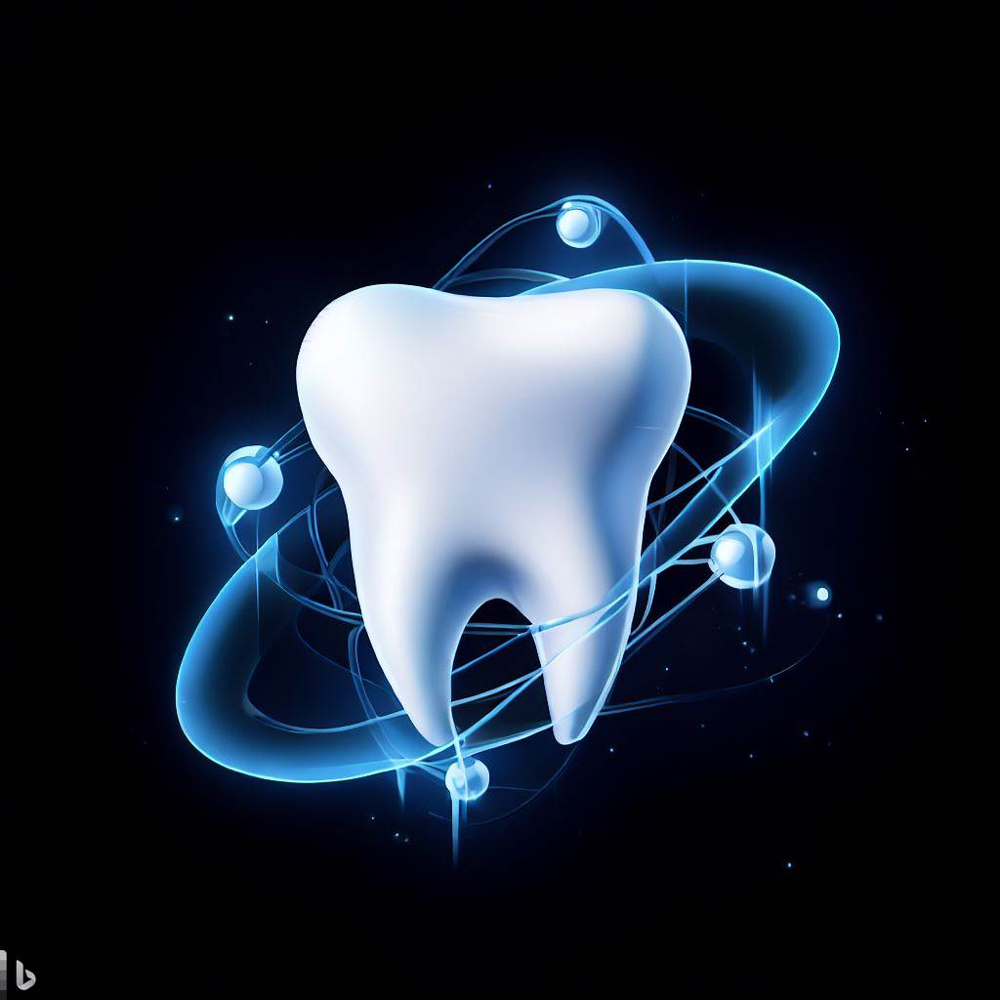

<p align="center">
  <a  target="blank"></a>
</p>

# DentalHUB Backend


## Descripción

DentalHUB es una aplicación completa para la gestión de clínicas dentales que incluye los siguientes módulos:

### Registro de paciente
Permite crear un modelo de paciente con campos como: nombre, fecha de nacimiento, número de teléfono, correo electrónico, dirección, historial médico, historial dental y notas adicionales.

### Evaluación y diagnóstico
Incluye modelos de examen dental y radiografía dental. El modelo de examen dental contiene información sobre el estado dental del paciente (caries, enfermedad de las encías, dientes faltantes). El modelo de radiografía dental incluye imágenes para ayudar en el diagnóstico.

### Plan de tratamiento
Permite crear planes que incluyen: lista de tratamientos recomendados, fechas programadas, estimación de costos y notas adicionales.

### Tratamiento
Modelos para cada tipo de tratamiento dental ofrecido: limpieza dental, empaste dental, extracción dental, etc.

### Registro y seguimiento
Registro del progreso del paciente, incluyendo fechas de visitas, tratamientos realizados y resultados.

### Facturación
Creación de facturas con: lista de tratamientos realizados, costos, descuentos aplicados, impuestos y total a pagar.

### Chatbot Dental con IA
Asistente virtual especializado en odontología que proporciona información sobre salud bucal, tratamientos dentales y prácticas de higiene oral.

### Portal de Pacientes
El staff otorga acceso al portal desde la pantalla de Pacientes (crea o vincula
una cuenta `Auth` con `role: PATIENT` al registro clínico del paciente). Con
esa cuenta, el paciente puede:
- Ver, solicitar y cancelar sus propias citas (`/appointment/me`)
- Ver un resumen de su historial clínico, sin notas internas ni radiografías (`/clinical-record/me/summary`)
- Ver su saldo, pagos y tratamientos facturados (`/billing/me/*`)

El ownership de estos endpoints se deriva siempre del `patientId` incluido en
el JWT del paciente — nunca de un id que mande el cliente.

### Recuperación de contraseña
Flujo de "olvidé mi contraseña" (`POST /auth/forgot-password` y
`POST /auth/reset-password`), aplicable a cualquier cuenta (staff o
paciente). El token de reseteo sigue el mismo patrón de hash + expiración
(TTL de Mongo) que el refresh token, es de un solo uso, y el email se envía
vía la API de [Resend](https://resend.com) (ver `RESEND_API_KEY` en
variables de entorno). El endpoint nunca revela si un email existe o no.

## Instalación

```bash
$ npm install
```

## Ejecutar la aplicación

```bash
# desarrollo
$ npm run start

# modo observador
$ npm run start:dev

# producción
$ npm run start:prod
```

## Configuración del Chatbot Dental con Ollama

El sistema incluye un chatbot dental basado en IA local utilizando Ollama. A continuación se detallan los pasos para configurarlo:

### 1. Configuración de Docker

El archivo `docker-compose.yml` ya incluye la configuración necesaria para Ollama:

```yaml
# Servicio de IA local usando Ollama
ollama:
  image: ollama/ollama:latest
  restart: always
  ports:
    - "11434:11434"
  volumes:
    - ollama_data:/root/.ollama
  environment:
    - OLLAMA_HOST=0.0.0.0:11434
  deploy:
    resources:
      limits:
        cpus: '4'
        memory: 8G
```

### 2. Iniciar los servicios

```bash
# Iniciar todos los servicios (MongoDB, Mongo Express y Ollama)
docker-compose up -d

# Verificar que los contenedores estén funcionando
docker ps
```

### 3. Descargar el modelo de IA

La primera vez que inicies Ollama, necesitarás descargar un modelo de IA:

```bash
# Descargar el modelo orca-mini (más rápido, ~2GB)
docker exec -it dentalhub_backend-ollama-1 ollama pull orca-mini

# O descargar el modelo llama3 (más preciso, ~4.7GB)
# docker exec -it dentalhub_backend-ollama-1 ollama pull llama3
```

### 4. Configuración del entorno

Asegúrate de que el archivo `.env` contenga estas variables:

```
# Ollama AI Configuration
OLLAMA_API_URL=http://localhost:11434
OLLAMA_MODEL=orca-mini
```

### 5. Probar el chatbot

```bash
# Ejemplo de consulta al chatbot
curl -X POST http://localhost:3000/ai/chat \
  -H "Content-Type: application/json" \
  -d '{
    "messages": [
      {
        "role": "user",
        "content": [
          {
            "type": "text",
            "text": "¿Cuáles son los síntomas de una caries dental?"
          }
        ]
      }
    ],
    "max_tokens": 2000
  }'
```

### Solución de problemas comunes

- **Error "model not found"**: Ejecuta el comando para descargar el modelo.
- **Error "getaddrinfo ENOTFOUND ollama"**: Verifica que en `.env` la URL sea `http://localhost:11434`.
- **Error con GPU**: Modifica `docker-compose.yml` para usar solo CPU como se muestra arriba.

Para más detalles, consulta el archivo [README-CHATBOT.md](./README-CHATBOT.md).

## Configuración de Recuperación de Contraseña (Resend)

El envío del email de "olvidé mi contraseña" usa la API HTTP de
[Resend](https://resend.com) (vía `fetch` nativo, sin dependencias nuevas).

### 1. Crear una API key

Crea una cuenta gratis en [resend.com](https://resend.com) y genera una API
key en [resend.com/api-keys](https://resend.com/api-keys).

### 2. Configurar el entorno

Agrega a tu `.env`:

```
RESEND_API_KEY=re_xxxxxxxxxxxxxxxxxxxxxxxx
RESEND_FROM=DentalHub <onboarding@resend.dev>
FRONTEND_URL=http://localhost:4200
PASSWORD_RESET_EXPIRES_IN_MINUTES=30
```

**Nota**: con el dominio de pruebas de Resend (`onboarding@resend.dev`) solo
se puede enviar al email con el que creaste la cuenta de Resend, salvo que
verifiques un dominio propio. Sin `RESEND_API_KEY`, el link de recuperación
se registra en el log del backend en vez de enviarse — sirve para probar el
flujo completo en desarrollo sin depender de una cuenta de Resend.

### 3. Probar el flujo

```bash
curl -X POST http://localhost:3001/v1/auth/forgot-password \
  -H "Content-Type: application/json" \
  -d '{"email":"usuario@ejemplo.com"}'
```

La respuesta es siempre el mismo mensaje genérico, exista o no el email
(evita revelar qué cuentas existen).

## Test

```bash
# unit tests
$ npm run test

# e2e tests
$ npm run test:e2e

# test coverage
$ npm run test:cov
```

Los tests unitarios (Jest) corren automáticamente en cada push/PR contra
`main` vía GitHub Actions (`.github/workflows/tests.yml` en la raíz del
repo). Usan repositorios en memoria (`in-memory-*.repository.ts`), no
requieren una base de datos real ni variables de entorno.

**Nota**: en Node.js 22+ (probado en Node 26) los tests que importan
`@nestjs/jwt` fallan al arrancar por una incompatibilidad de
`buffer-equal-constant-time` (dependencia de `jsonwebtoken`) con el módulo
`buffer` de Node — usa Node 20 LTS para desarrollo local (mismo runtime que
usa el CI).

## Paso a Paso

```bash

#Subir DockerFile a DockerHub
$ docker build -t samirjhb/api-dental-hub .

$ docker push samirjhb/api-dental-hub

# Irse a la carpeta de K8S para crear el deploymet
$ kubectl create -f deployment.yaml

# Verificar el PODS
$ kubectl get pods -o wide

#Seleccionar el POD a revisar 
$ kubectl logs nestjs-k8s-786566ccf7-c2dl7

# Posteriomente  creacion del servicio 
$ kubectl create -f service.yaml

#Verificacion del service 
$ kubectl get service


```

## Author

- Samir Hadechni  - [ 🧑🏻‍💻](https://github.com/samirjhb)
